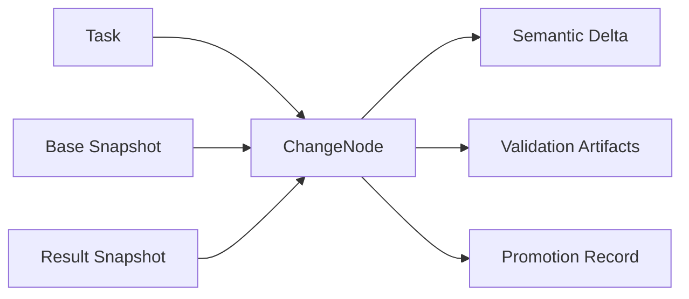
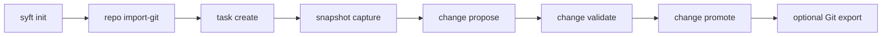

# syft

`syft` is a version control experiment for AI-heavy development.

The short version is this: Git is good at snapshots and patches. It is less helpful when the thing you are trying to keep track of is a task, a few candidate solutions, the validation evidence, and the final promoted result.

That gap shows up fast once AI is in the loop.

You ask for a change. The model tries one path, then another. Maybe one passes tests and one almost works. Maybe both are messy in different ways. By the time you get to something worth keeping, the raw diff is only part of the story.

That is what `syft` is trying to hold onto.

## What it is trying to model

The center of the system is a `ChangeNode`.

A change node ties together:

- the task
- the base snapshot
- the result snapshot
- the intent
- the semantic delta
- the validation artifacts
- the promotion state

That gives you a better unit for AI-assisted work than a commit by itself.



Commits still matter. Diffs still matter. Git still matters. They just are not enough on their own once you have multiple attempts and tool-driven changes flying around.

## Why build this at all

This came from a pretty practical frustration.

Git can tell you what changed. It does not really tell you what the change was for, what else was tried, what evidence came with it, or why this candidate was the one that got kept.

In ordinary hand-written work, people usually patch over that with branch names, commit messages, PR descriptions, CI links, and memory.

That starts to feel thin with AI.

The pace is different. The number of candidates is different. The amount of bookkeeping goes up. You end up wanting a first-class record of intent and validation, not just a final patch.

That is the bet here.

## Where it is better than Git for AI work

I think `syft` is better than plain Git in a few specific ways.

It keeps the task attached to the change. That matters more than it sounds. A lot of AI work goes sideways because the actual goal gets separated from the patch.

It keeps validation attached to the candidate. In Git, CI sits next to the commit. Here the validation artifacts belong to the change node itself, which is a much better fit when you are comparing attempts.

It makes promotion explicit. You can have several candidate changes for one task and still make one clear decision about what actually moved forward.

It has room for semantic review. Right now that part is still small and Rust-only, but the direction is right. If a change touched a public symbol or shifted a dependency edge, the system should surface that directly.

It also fits parallel exploration better. Branches work. They just are not really the same thing as “three candidate implementations of the same intent.”

## Where it is still just a bootstrap

This project is still early.

It is local-first. There is no API layer, no worker system, no remote coordination, no multi-language semantic engine, and no native storage backend replacing Git.

That was deliberate.

The first job was to prove the model in a real repo with a real CLI and a real end-to-end loop. That part matters more than drawing a giant future architecture and pretending it already exists.

## What exists today

The current workspace supports this flow:

1. initialize a `syft` repo
2. import a Git commit into a snapshot
3. create a task
4. capture a result snapshot from the worktree
5. propose a change node against a base snapshot
6. run validation on that result snapshot
7. promote the change and optionally export it back to Git



It also has the read-side commands you need to inspect the state of the repo:

- `status`
- `history`
- `snapshot list`, `show`, `diff`
- `task list`, `show`, `current`, `set-current`, `changes`
- `change list`, `show`, `latest`, `diff`, `validate`, `promote`

## Design choices that matter

### Git stays underneath for now

`syft` imports from Git and can export promoted snapshots back to Git.

That keeps the system usable while the model is still taking shape. It also means this can be tested in normal repos without asking anyone to buy into a full replacement story upfront.

### Changes are heavier than commits

That is intentional.

A change node is carrying more context because AI-assisted work usually needs more context. The extra weight is the point.

### The system is local-first

Everything lives under `.syft/`.

Metadata is in SQLite. Objects are on disk. Validation runs locally against a materialized snapshot. There is a lot less machinery here than there would be in a service-first design.

### Branches are secondary

Internally this is more about tasks, snapshots, changes, and promotions than about branches.

Branches still matter at the Git boundary. They just are not the main shape of the system.

## FAQ

### Is this trying to replace Git?

No. Not today.

Git is still the import and export layer. `syft` is acting more like a richer control plane on top of it.

### Why not just use branches and pull requests?

You can get part of the way there with branches and PRs.

What they do not give you very well is a first-class record of multiple candidate implementations for one task, along with their semantic deltas, validation artifacts, and promotion state.

That is the part `syft` is focused on.

### Why is this useful for AI specifically?

Because AI tends to increase the number of attempts.

Once you have a few candidate changes for one intent, plus validation output, plus some amount of semantic review, a commit log starts to feel too flat. You want something closer to a task-and-candidate graph.

### Why keep Git at all?

Because it is still the easiest way to stay compatible with the rest of the world.

Repos, hosting, review tools, and developer habits already run through Git. Throwing that away early would make the project harder to test and easier to hand-wave.

### What does `syft` actually store?

Right now it stores repo metadata, snapshots, tasks, change nodes, validation artifacts, and promotions under `.syft/`.

SQLite holds the metadata. The object store holds blobs, trees, snapshot content, and full validation logs.

### Why are snapshots local-first?

Because the problem being worked on first is modeling the change properly.

Remote sync, APIs, workers, and multi-user coordination are real problems. They are just later problems.

### Is the semantic layer production ready?

No.

It is useful, but still pretty narrow. It is Rust-only right now and meant to prove the shape of semantic review, not to claim full language coverage.

### Is this better than Git already?

For general version control, no.

For AI-heavy change exploration, I think it is heading in a better direction because it has better places to store task intent, validation evidence, and promotion decisions.

That is still being proven. The current version is honest bootstrap software.

## Install

If you want the binary from GitHub releases, use the install scripts.

On macOS or Linux:

```bash
curl -fsSL https://raw.githubusercontent.com/chaqchase/syft/main/scripts/install.sh | sh
```

For a specific version:

```bash
curl -fsSL https://raw.githubusercontent.com/chaqchase/syft/main/scripts/install.sh | sh -s -- v0.1.0
```

On Windows PowerShell:

```powershell
irm https://raw.githubusercontent.com/chaqchase/syft/main/scripts/install.ps1 | iex
```

For a specific version:

```powershell
& ([scriptblock]::Create((irm https://raw.githubusercontent.com/chaqchase/syft/main/scripts/install.ps1))) "v0.1.0"
```

## Read the rest

The README stays high level on purpose.

The technical detail is in [`docs/README.md`](/Users/mohamedachaq/rework/cronacl-saas/git-alrt/syft/docs/README.md):

- workspace and crate layout
- storage model
- CLI behavior
- development notes
