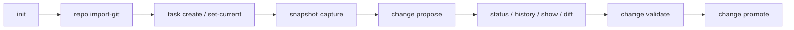
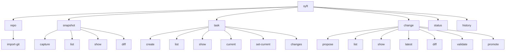
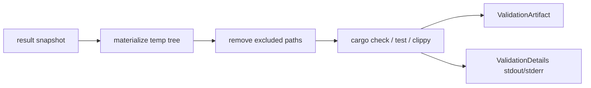

# CLI and Workflow

The CLI is the only user interface right now.

Every command also supports `--json` at the top level if you want machine-readable output.



## Basic repo flow

This is the normal bootstrap path:

```bash
syft init --name my-repo
syft repo import-git --commit HEAD
syft task create --title "Add status output"
syft task set-current <task-id>
syft snapshot capture
syft change propose --title "Implement status command" --intent "Add repo status view" --result <snapshot-id>
syft change validate <change-id> --typecheck --tests
syft change promote <change-id> --to main
```

That is the whole system in a small loop.

## Command map



## Command groups

## `syft init`

Initializes `.syft/` inside the current Git repo.

It creates:

- `.syft/repo.toml`
- `.syft/state/`
- `.syft/cache/`
- `.syft/index/`
- `.syft/objects/`

It also sets up `.git/info/exclude` so `.syft/` stays out of Git by default.

If you want a dedicated `syft` ignore file, you can run:

```bash
syft init --sync-gitignore
```

That seeds `.syftignore` from the current `.gitignore`.

## `syft repo import-git`

Imports a Git commit into a `syft` snapshot.

Example:

```bash
syft repo import-git --commit HEAD
```

This is usually how you establish the base snapshot before starting work.

## `syft snapshot`

### `syft snapshot capture`

Captures the current worktree into a new snapshot.

This does not move `.syft/state/head`.

That is important. It means you can capture a work-in-progress result and still propose it against the current head by default.

It also applies built-in safe exclusions while capturing:

- `.git`
- `.syft`
- `target`

By default, worktree capture respects `.gitignore`.

If `.syftignore` exists, `syft` reads that too.

### `syft snapshot list`

Lists snapshots for the current repo.

### `syft snapshot show <snapshot-id>`

Shows the snapshot metadata, parents, root tree hash, and derived summary fields.

### `syft snapshot diff <from> <to>`

Computes file-level patch ops between two snapshots.

This is a review tool, not a unified diff viewer. It tells you what changed at the file operation level.

## `syft task`

### `syft task create`

Creates a task with title, description, acceptance criteria, constraints, labels, and priority.

Creating a task does not make it current automatically.

### `syft task list`

Lists tasks in the repo.

### `syft task show <task-id>`

Shows the full task record.

### `syft task set-current <task-id>`

Writes the task ID to `.syft/state/current_task` after validating that the task exists.

### `syft task current`

Shows the current task if one is set.

Text mode prints `no current task` if nothing is set.

JSON mode returns `null`.

### `syft task changes <task-id>`

Lists changes attached to a given task.

This is the easiest way to inspect a task once it has multiple candidate changes.

## `syft change`

### `syft change propose`

Creates a change node from a base snapshot and a result snapshot.

Required arguments:

- `--title`
- `--intent`
- `--result`

Optional arguments:

- `--task`
- `--base`
- `--rationale`
- `--tag`

Defaults:

- if `--task` is omitted, `syft` uses `.syft/state/current_task`
- if `--base` is omitted, `syft` uses `.syft/state/head`

If either value cannot be resolved, the command fails with a clear error.

### `syft change list`

Lists change nodes repo-wide.

### `syft change show <change-id>`

Shows the full change record, including semantic summary and validation summaries.

Use `--logs` to include stored stdout/stderr from validation runs.

### `syft change latest`

Shows the latest change in detail.

Resolution order:

1. `--task <id>` if provided
2. current task if one is set
3. latest change repo-wide

This saves a lot of manual ID lookup once you start using the tool regularly.

### `syft change diff <change-id>`

Shows the stored patch ops for a change node.

Text output gives you:

- a count summary by op kind
- one row per op

JSON output includes the full patch op list and summary counts.

### `syft change validate <change-id>`

Runs validation against the result snapshot for that change.

Supported flags:

- `--typecheck`
- `--tests`
- `--lint`

These map to local cargo commands run against a materialized snapshot.

Validation runs in a clean temp build directory and clears excluded paths out of the materialized tree first. That keeps stale generated output from making a broken change look healthy.



### `syft change promote <change-id> --to <lineage>`

Marks a change as promoted and optionally exports it back into Git.

Use `--no-export` if you want the promotion record without making a Git commit.

## `syft status`

Shows a repo summary:

- repo name and ID
- current head snapshot
- latest snapshot timestamp
- task counts
- change counts
- latest promoted change
- latest validated or failed change
- attention-needed notes

This is the quickest way to see whether the repo is in a sane state.

## `syft history`

Shows recent change-centric history.

Supported filters:

- `--task <id>`
- `--symbol <qualified-path>`
- `--limit <n>`

History is newest-first.

The symbol filter works off stored semantic deltas. There is no persistent symbol index yet.

## A few practical notes

### Capture before propose

`change propose` needs a result snapshot ID. It does not capture automatically.

That is a deliberate choice in the current version. It keeps the write path explicit.

### Set a current task early

If you are going to stay in the same task for a while, run:

```bash
syft task set-current <task-id>
```

It makes the rest of the flow much smoother.

### Use JSON for tooling

The text output is for humans. The JSON output is stable enough to script against if you want to build wrappers or editor tooling on top.
