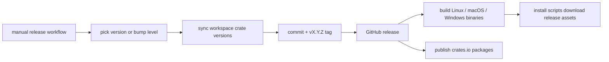
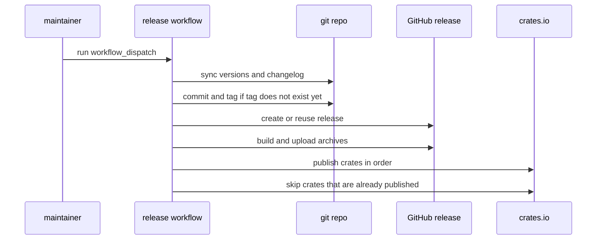

# Releasing

The release flow is manual, semver-based, and meant to be easy to rerun.

- crates.io publishing for the workspace crates
- GitHub releases for the `syft` binary
- semantic versioning driven by an explicit version or a patch/minor/major bump choice



The GitHub Actions setup lives in:

- `.github/workflows/ci.yml`
- `.github/workflows/release.yml`

`ci.yml` runs the test suite on Linux, macOS, and Windows. It also checks the workspace metadata and packages `syft-types`, which is the only crate that can be fully package-checked before the rest of the workspace exists on crates.io.

The dependent crates get their real publish validation in the release job itself, in publish order, with retries for crates.io index lag.

`release.yml` is the only release workflow now.

It runs manually with `workflow_dispatch`.

You can either:

- pass an explicit version like `0.2.1`
- or let the workflow compute the next version from a `patch`, `minor`, or `major` bump input

It does five things:

1. Syncs the workspace version and all internal crate dependency versions from one place.
2. Builds release binaries for:
   - Linux x86_64
   - macOS x86_64
   - macOS arm64
   - Windows x86_64
3. Publishes a GitHub release with archives and a `SHA256SUMS.txt` file.
4. Publishes the crates to crates.io in dependency order.
5. Skips already-published crates so reruns do not blow up halfway through.



## Retry behavior

This is the important part.

If a release fails halfway through, rerun the workflow with the same explicit version.

The workflow will:

- reuse the existing tag if it already exists
- reuse the GitHub release if it already exists
- upload release assets with clobber
- skip crates that are already published on crates.io

That makes retries much less fragile than the old flow.

## Versioning

The project still follows semantic versioning.

Use:

- `patch` for fixes and small internal improvements
- `minor` for backward-compatible features
- `major` for breaking changes

If you need full control, pass the exact version in the workflow input instead of using a bump level.

## Required secret

The crates publish job needs this secret:

- `CARGO_REGISTRY_TOKEN`

If that secret is missing, the binary release still runs. The crates.io publish step logs that it skipped publishing.

## What changed in the release setup

The old release setup was too easy to desync.

The main failure was that the workspace version changed while internal crate dependency versions stayed behind. That broke `cargo metadata` and release jobs at the worst possible time.

The current setup fixes that by using one root version source and syncing the internal crate versions before tagging.

## Install from releases

There are two install scripts in `scripts/`.

- `scripts/install.sh`
- `scripts/install.ps1`

They download the latest release by default. You can also pass a version.

Examples:

```bash
./scripts/install.sh
./scripts/install.sh v0.1.0
```

If you want to install straight from the repo without cloning it first:

```bash
curl -fsSL https://raw.githubusercontent.com/chaqchase/syft/main/scripts/install.sh | sh
curl -fsSL https://raw.githubusercontent.com/chaqchase/syft/main/scripts/install.sh | sh -s -- v0.1.0
```

```powershell
./scripts/install.ps1
./scripts/install.ps1 v0.1.0
```

And from PowerShell without cloning the repo:

```powershell
irm https://raw.githubusercontent.com/chaqchase/syft/main/scripts/install.ps1 | iex
& ([scriptblock]::Create((irm https://raw.githubusercontent.com/chaqchase/syft/main/scripts/install.ps1))) "v0.1.0"
```

By default the scripts install into a user-local bin directory.

- Unix: `$HOME/.local/bin`
- Windows: `%USERPROFILE%\.local\bin`

You can override that with `SYFT_INSTALL_DIR`.
